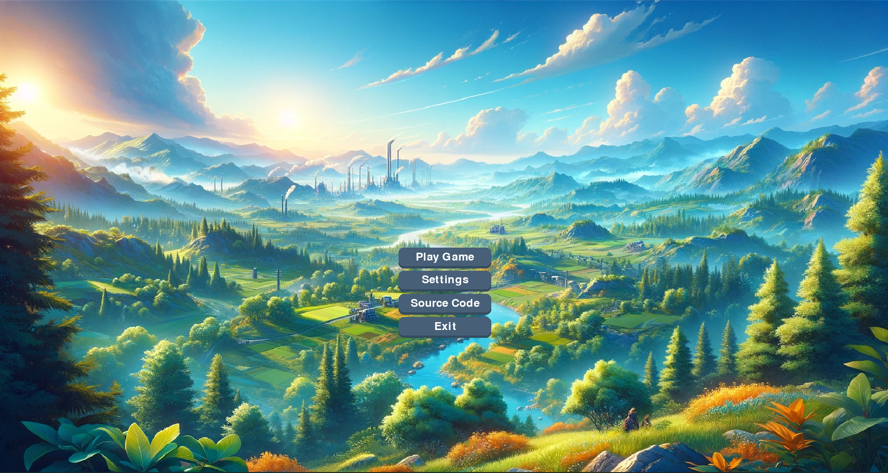
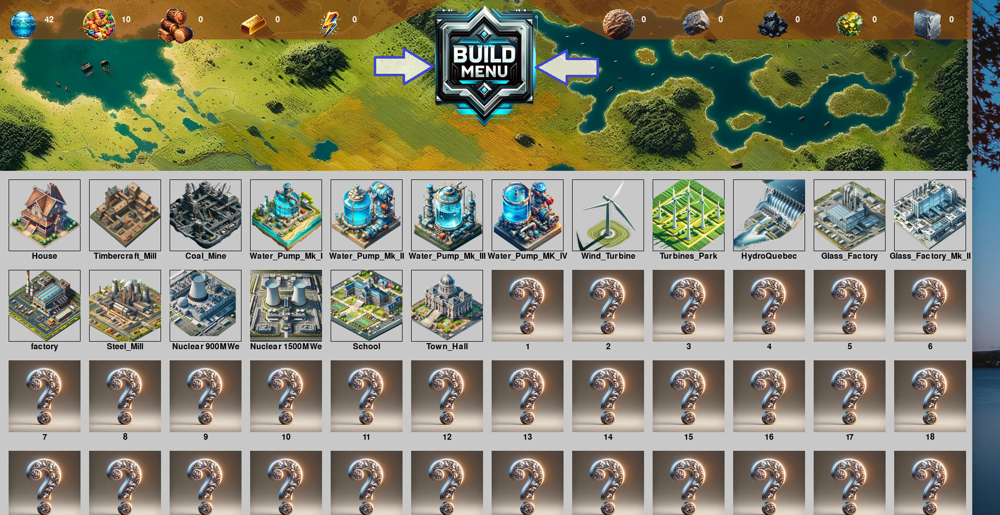
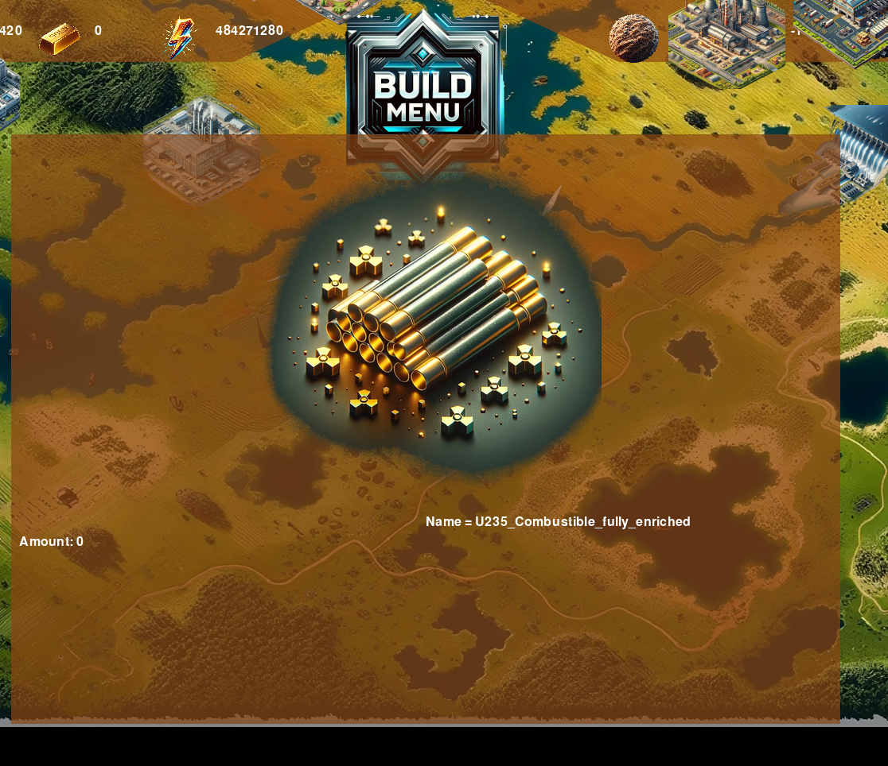
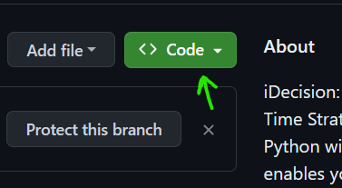
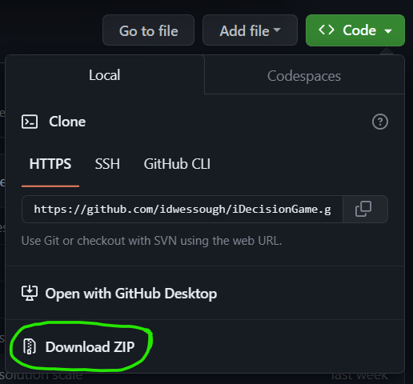
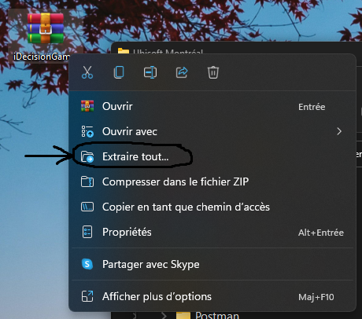
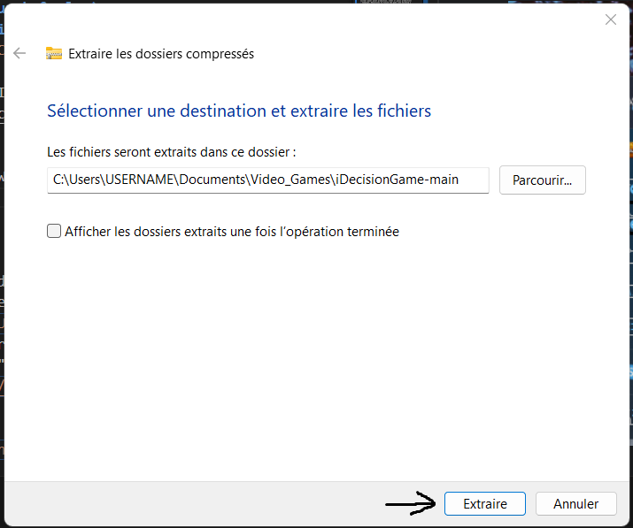
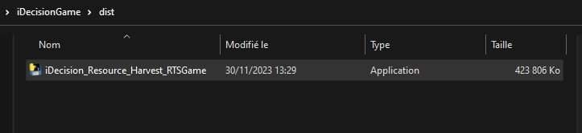

# iDecision: Resource Harvest (Real Time Strategy Game)
iDecision: Resource Harvest is my brand new Real Time Strategy (RTS) game developed in Python with Pygame framework. It enables you to devise real strategies in gameplay and take advantage of your resource management skills.
 
 Enjoy the beautiful assets designed and created for this occasion!

Software tools : Python (PyGame, Pandas),
Assets tools : Photoshop, Gimp, DALLE (AI), Unreal Engine & Unity (just screenshots my assets from topview)

#### Disclaimer: 
This game is in development stage for now. Lots of features are comming soon and here is what is currently available (see images below) : 


    *****1) Home Menu*****
  <br>  
  

    *****2) Game mapping***** (zoom, movements with arrows or by touching corners of screen)
  <br>  
  

    *****3) Build Menu***** (Create buildings that cost resources and gather other resources at specific rates) 
  <br>  
  


    *****4) Resources Management & Logic***** (Buying buildings, gather resources..)
  <br>


    *****5) Resources details***** panel will show insights about specific resource when a player clicks on a resource icon (in development)
    <br>
What's coming ([**Learn more about iDecision project here: board roadmap**](https://github.com/users/idwessough/projects/2)): 
- Weather control (day/night shifts, snow effects)
- Create sounds
- Create more buildings and resources assets, create a building details menu when clicking on a building (where you could manage nuclear power plant production, steel or glass production)
- Campaign, Objectives to finish the game like building a MERVEILLE, gather certains amount of specific resource type, discover technologies
- Project managment board gives you insights about advancement of those features [in "Project" tab or click here](https://github.com/users/idwessough/projects/2)

## Quick Start (How To Launch & Play):
#### Option A: Easy way (Windows only, without any requirements):
1) Click "Code"  
2) Then Click "Download ZIP" 
3) Move ZIP file to wherever you want (e.g.: "C:/Users/UserName/Documents/Vido_Games/")
4) Extract ZIP File with Windows or Winrar 
5) Confirm Windows dialog box with desired path 
6) Open Game folder and access to "dist" folder to open the executable Application file (.exe) 
7) A Window will open, then wait 2 to 10 seconds for game to launch. If it does not launch and stay stucks in a terminal, just click on the terminal and hit "Enter" key. The game will open shortly, you can enjoy it and suggest any imrovement. Hope you appreciate it, thanks. :)

#### Option B: If you have Python installed with PyGame requirements:

1) Open a terminal on Windows Terminal, VS Code or other
2) Navigate to your desired path e.g.:
        ````cd "C:/Users/UserName/Documents/Vido_Games/"```` 
3) Make sure you know your python interpreter and it is added to path, with alias "py" or "python" 
4) ```` git clone https://github.com/idwessough/iDecisionGame.git````
5) ````ls```` 
6) Launch game ```` python home_menu.py ````
7) Enjoy ! 

Git Large File Storage is Configured in this repo to handle .exe and .pkg files. Allowing users to easily play the game.


Idwes Alexandre SOUGH
